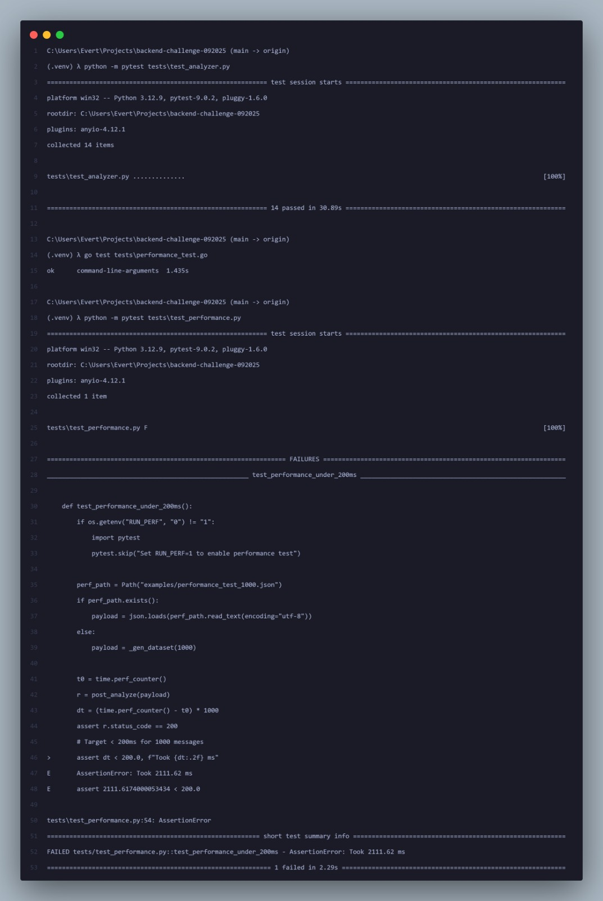

## ✏️ Como iniciar
```bash
go mod tidy

go run .
```

## 🧪 Como iniciar os testes
```bash
# Python version: 3.12.9
python -m venv .venv && source .venv/bin/activate  # Windows: .venv\Scripts\activate
pip install -r requirements.txt

python -m pytest
--------------------------
# Go version: 1.25+
go test ./... -v
```

## Observação
- foram encontrados cenários onde, sem o devido tratamento, invalidam os testes. Peço que faça uma revisão das datas e horários antes de executar

- Testes de performance < 200ms falharam no test_performance.py mas passam no performance_test.go




## ✅ Checklist de Entrega

### Funcionalidade
- [X] Todos os 6 casos de teste passam
- [X] Endpoint HTTP funcional
- [X] Validações 400/422 implementadas
- [X] Função pura disponível para testes

### Performance
- [X] < 200ms para 1000 mensagens (opcional)
- [X] Uso de memória otimizado
- [ ] Algoritmos O(n log n) ou melhor

### Qualidade
- [X] Código organizado e documentado
- [X] README com instruções claras (≤ 5 comandos)
- [X] Outputs determinísticos
- [ ] Tratamento de edge cases

### Algoritmos
- [X] Tokenização/normalização NFKD
- [X] Janela temporal relativa ao timestamp da requisição
- [ ] Ordem de precedência correta no sentimento
- [X] Flags MBRAS case-insensitive
- [ ] Anomalias e trending implementados
- [ ] SHA-256 determinístico para influência

### CI
- [X] Criação de um workflow do git actions
- [X] Criar um CI de ao menos 3 etapas